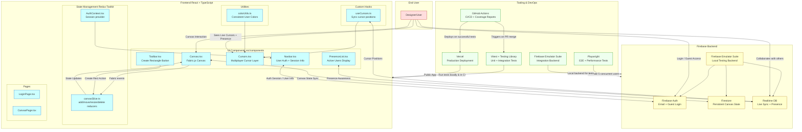

# super-duper-fiesta
Gauntlet AI Cohort 3 Challenge 1: Collab Canvas

```mermaid
flowchart TD
    %% ========================
    %% FRONTEND ARCHITECTURE
    %% ========================

    subgraph Frontend[Frontend React + TypeScript]
        subgraph UI[UI Components src/components]
            A1[Canvas.tsx
Fabric.js Canvas]
            A2[Toolbar.tsx
Create Rectangle Button]
            A3[Cursors.tsx
Multiplayer Cursor Layer]
            A4[PresenceList.tsx
Active Users Display]
            A5[Navbar.tsx
User Auth + Session Info]
        end

        subgraph State[State Management Redux Toolkit]
            B1[canvasSlice.ts
add/move/resize/delete reducers]
            B2[AuthContext.tsx
Session provider]
        end

        subgraph Hooks[Custom Hooks]
            C1[useCursors.ts
Sync cursor positions]
        end

        subgraph Utils[Utilities]
            D1[colorUtils.ts
Consistent User Colors]
        end

        subgraph Pages[Pages]
            E1[LoginPage.tsx]
            E2[CanvasPage.tsx]
        end

        %% Local communication
        A1 -->|Fabric events| B1
        A2 -->|Create Rect Action| B1
        B1 -->|State Updates| A1
        B2 --> A5
        C1 --> A3
        D1 --> A3
    end


    %% ========================
    %% BACKEND / SERVER SIDE
    %% ========================

    subgraph Firebase[Firebase Backend]
        F1[Firebase Auth
Email + Guest Login]
        F2[Firestore
Persistent Canvas State]
        F3[Realtime DB
Live Sync + Presence]
        F4[Firebase Emulator Suite
Local Testing Backend]
    end

    %% Connections: frontend to backend
    A1 <-->|Canvas State Sync| F2
    C1 <-->|Cursor Positions| F3
    A4 <-->|Presence Awareness| F3
    A5 <-->|Auth Session / User Info| F1
    F4 --> F1
    F4 --> F2
    F4 --> F3

    %% ========================
    %% TOOLING / DEVOPS LAYER
    %% ========================

    subgraph Tooling[Tooling & DevOps]
        G1[Vitest + Testing Library
Unit + Integration Tests]
        G2[Playwright
E2E + Performance Tests]
        G3[Firebase Emulator Suite
Integration Backend]
        G4[GitHub Actions
CI/CD + Coverage Reports]
        G5[Vercel
Production Deployment]
    end

    %% Test + CI flows
    G1 -->|Run tests locally & in CI| Frontend
    G2 -->|Simulate 5 concurrent users| Firebase
    G3 -->|Local backend for tests| Firebase
    G4 -->|Triggers on PR merge| G1
    G4 -->|Deploys on successful tests| G5
    G5 -->|Public App| Frontend

    %% ========================
    %% USER INTERACTION FLOW
    %% ========================
    subgraph User[End User]
        U1[Designer/User]
    end

    U1 -->|Login / Guest Access| F1
    U1 -->|Canvas Interaction| A1
    U1 -->|Sees Live Cursors + Presence| A3
    U1 -->|Collaborates with others| F3

    %% ========================
    %% DESCRIPTIVE LABELS
    %% ========================
    classDef comp fill:#cff,stroke:#06c,stroke-width:1px;
    classDef server fill:#ffc,stroke:#a60,stroke-width:1px;
    classDef tool fill:#efe,stroke:#080,stroke-width:1px;
    classDef user fill:#fdd,stroke:#a00,stroke-width:1px;

    class A1,A2,A3,A4,A5,B1,B2,C1,D1,E1,E2 comp
    class F1,F2,F3,F4 server
    class G1,G2,G3,G4,G5 tool
    class U1 user
```