```mermaid
graph TB
    subgraph ClientApplication["Client Application"]
        subgraph ReactComponents["React Components"]
            APP[App.tsx<br/>Main Application]
            AUTH_PAGE[Auth Pages<br/>Login/Signup]
            CANVAS[Canvas Component<br/>Main Workspace]
            TOOLBAR[Toolbar Component<br/>Top Controls]
            NOTIF[Notification Component<br/>Auto-fade Messages]
            CURSOR[Cursor Component<br/>Other Users' Cursors]
            USER_LIST[User List Component<br/>Online Users]
            EMPTY_STATE[Empty State<br/>Getting Started]
        end
        
        subgraph ReduxStore["Redux Store - Redux Toolkit"]
            AUTH_SLICE[Auth Slice<br/>User Profile & Session]
            CANVAS_SLICE[Canvas Slice<br/>Objects Array]
            VIEWPORT_SLICE[Viewport Slice<br/>Pan/Zoom State]
            SELECTION_SLICE[Selection Slice<br/>Selected Object ID]
            PRESENCE_SLICE[Presence Slice<br/>Online Users]
            LOCK_SLICE[Lock Slice<br/>Object Locks]
            CURSOR_SLICE[Cursor Slice<br/>User Cursors]
        end
        
        subgraph FabricLayer["Fabric.js Layer"]
            FABRIC_CANVAS[Fabric.js Canvas<br/>5000x5000px]
            FABRIC_RECT[Rectangle Objects<br/>Interactive Shapes]
            FABRIC_EVENTS[Event Handlers<br/>Mouse/Touch Events]
        end
        
        subgraph UtilsHelpers["Utils & Helpers"]
            COLOR_HASH[Color Hash Util<br/>Email to Color Mapping]
            ID_GEN[ID Generator<br/>UUID Creation]
            THRESHOLD[Threshold Detector<br/>5px Movement Check]
            OVERLAP[Overlap Detector<br/>Rectangle Collision]
            SERIALIZER[Object Serializer<br/>Redux to Firestore]
            ZINDEX[Z-Index Calculator<br/>Layer Management]
        end
        
        subgraph FirebaseSDK["Firebase SDK"]
            FB_CONFIG[Firebase Config<br/>Dev/Prod Switch]
            FB_AUTH_SDK[Firebase Auth SDK]
            FB_FIRESTORE_SDK[Firestore SDK]
            FB_RTDB_SDK[Realtime DB SDK]
        end
        
        subgraph SyncLayer["Sync Layer"]
            SYNC_MANAGER[Sync Manager<br/>Firestore Listener]
            CURSOR_SYNC[Cursor Sync<br/>Throttled Updates]
            PRESENCE_SYNC[Presence Sync<br/>User Online/Offline]
            LOCK_SYNC[Lock Sync<br/>Object Locking]
            STATE_RECONCILE[State Reconciler<br/>Merge Local+Remote]
        end
    end
    
    subgraph FirebaseBackend["Firebase Backend"]
        subgraph FirebaseAuthentication["Firebase Authentication"]
            FB_AUTH[Firebase Auth<br/>Email/Password<br/>Anonymous]
        end
        
        subgraph FirestoreDatabase["Firestore Database"]
            CANVAS_DOC[canvases/main<br/>Document]
            OBJECTS_ARRAY[objects Array<br/>All Rectangles]
            USER_PROFILES[users/userId<br/>Profile Data]
        end
        
        subgraph RealtimeDatabase["Realtime Database"]
            PRESENCE_NODE[presence/userId<br/>Online Status]
            CURSOR_NODE[cursors/userId<br/>x, y, timestamp]
            LOCK_NODE[locks/objectId<br/>userId, displayName]
            CONNECTION_NODE[.info/connected<br/>Connection Status]
        end
    end
    
    subgraph VercelHosting["Vercel Hosting"]
        VERCEL[Vercel Platform<br/>Static Hosting]
        ENV_VARS[Environment Variables<br/>Firebase Config]
    end

    APP --> AUTH_PAGE
    APP --> CANVAS
    APP --> TOOLBAR
    CANVAS --> FABRIC_CANVAS
    CANVAS --> CURSOR
    CANVAS --> NOTIF
    CANVAS --> EMPTY_STATE
    TOOLBAR --> USER_LIST
    FABRIC_CANVAS --> FABRIC_RECT
    FABRIC_CANVAS --> FABRIC_EVENTS

    AUTH_PAGE --> AUTH_SLICE
    CANVAS --> CANVAS_SLICE
    CANVAS --> VIEWPORT_SLICE
    CANVAS --> SELECTION_SLICE
    TOOLBAR --> CANVAS_SLICE
    USER_LIST --> PRESENCE_SLICE
    CURSOR --> CURSOR_SLICE
    FABRIC_EVENTS --> SELECTION_SLICE
    FABRIC_EVENTS --> CANVAS_SLICE
    FABRIC_EVENTS --> LOCK_SLICE

    FABRIC_EVENTS -.->|Pan/Zoom| VIEWPORT_SLICE
    FABRIC_EVENTS -.->|Drag/Resize| CANVAS_SLICE
    FABRIC_EVENTS -.->|Click Select| SELECTION_SLICE
    FABRIC_RECT -.->|Render from| CANVAS_SLICE

    AUTH_PAGE --> COLOR_HASH
    CANVAS --> ID_GEN
    CANVAS --> OVERLAP
    CANVAS --> ZINDEX
    SYNC_MANAGER --> SERIALIZER
    FABRIC_EVENTS --> THRESHOLD

    AUTH_PAGE --> FB_AUTH_SDK
    SYNC_MANAGER --> FB_FIRESTORE_SDK
    CURSOR_SYNC --> FB_RTDB_SDK
    PRESENCE_SYNC --> FB_RTDB_SDK
    LOCK_SYNC --> FB_RTDB_SDK
    FB_AUTH_SDK --> FB_CONFIG
    FB_FIRESTORE_SDK --> FB_CONFIG
    FB_RTDB_SDK --> FB_CONFIG

    SYNC_MANAGER --> CANVAS_SLICE
    CURSOR_SYNC --> CURSOR_SLICE
    PRESENCE_SYNC --> PRESENCE_SLICE
    LOCK_SYNC --> LOCK_SLICE
    STATE_RECONCILE --> CANVAS_SLICE

    CANVAS_SLICE -.->|Create/Update/Delete| SYNC_MANAGER
    CURSOR_SLICE -.->|Position Update| CURSOR_SYNC
    PRESENCE_SLICE -.->|Join/Leave| PRESENCE_SYNC
    LOCK_SLICE -.->|Acquire/Release| LOCK_SYNC

    FB_AUTH_SDK -->|Authenticate| FB_AUTH
    FB_AUTH_SDK -->|Create Profile| USER_PROFILES
    FB_FIRESTORE_SDK -->|Read/Write| CANVAS_DOC
    FB_FIRESTORE_SDK -->|Listen| CANVAS_DOC
    FB_FIRESTORE_SDK -->|Write| USER_PROFILES
    FB_RTDB_SDK -->|Write/Listen| PRESENCE_NODE
    FB_RTDB_SDK -->|Write/Listen| CURSOR_NODE
    FB_RTDB_SDK -->|Write/Listen| LOCK_NODE
    FB_RTDB_SDK -->|Listen| CONNECTION_NODE

    CANVAS_DOC --> OBJECTS_ARRAY

    VERCEL --> APP
    ENV_VARS --> FB_CONFIG

    classDef reactClass fill:#61dafb,stroke:#333,stroke-width:2px,color:#000
    classDef reduxClass fill:#764abc,stroke:#333,stroke-width:2px,color:#fff
    classDef fabricClass fill:#ff6b6b,stroke:#333,stroke-width:2px,color:#fff
    classDef firebaseClass fill:#ffca28,stroke:#333,stroke-width:2px,color:#000
    classDef utilClass fill:#4ecdc4,stroke:#333,stroke-width:2px,color:#000
    classDef syncClass fill:#95e1d3,stroke:#333,stroke-width:2px,color:#000
    classDef deployClass fill:#a8e6cf,stroke:#333,stroke-width:2px,color:#000

    class APP,AUTH_PAGE,CANVAS,TOOLBAR,NOTIF,CURSOR,USER_LIST,EMPTY_STATE reactClass
    class AUTH_SLICE,CANVAS_SLICE,VIEWPORT_SLICE,SELECTION_SLICE,PRESENCE_SLICE,LOCK_SLICE,CURSOR_SLICE reduxClass
    class FABRIC_CANVAS,FABRIC_RECT,FABRIC_EVENTS fabricClass
    class FB_CONFIG,FB_AUTH_SDK,FB_FIRESTORE_SDK,FB_RTDB_SDK,FB_AUTH,CANVAS_DOC,OBJECTS_ARRAY,USER_PROFILES,PRESENCE_NODE,CURSOR_NODE,LOCK_NODE,CONNECTION_NODE firebaseClass
    class COLOR_HASH,ID_GEN,THRESHOLD,OVERLAP,SERIALIZER,ZINDEX utilClass
    class SYNC_MANAGER,CURSOR_SYNC,PRESENCE_SYNC,LOCK_SYNC,STATE_RECONCILE syncClass
    class VERCEL,ENV_VARS deployClass
```

## AI Agent (Phase 6) – Overview

This project includes a client-side AI agent that can create and manipulate canvas objects via natural language. The current implementation runs entirely on the client (no Cloud Function queue processor yet) and uses a Vercel serverless proxy for OpenAI chat replies.

### Key Features
- Shared chat (`chats/{canvasId}/messages`) with AI responses after command execution using tool-calling confirmations.
- Command queue (`commandQueue/{canvasId}/commands`) processed on the client (FIFO).
- AI tool wrappers for:
  - Creation: rectangle, circle, text
  - Manipulation: move, resize, rotate, delete
  - Layout: arrange horizontal/vertical/grid, distribute evenly
  - Queries: get canvas state, select by description, get viewport center
- AI-only undo (client-side): undo last / undo last N using per-command snapshots in `aiCommands`.

### Validation & Arrangement Scope
- Resize validation: minimum geometry sizes enforced (`MIN_GEOMETRY_SIZE`), and world-bounds checks prevent sizes/positions exceeding 5000x5000.
- Circle resize: radius translated to diameter with the same validations.
- Text resize: font size scales bounding box proportionally while staying within world bounds.
- Arrangement scope: arrange/distribute defaults to objects created by the last AI command; include existing by saying “include existing/all/everything”.

### Firestore Collections (AI)
- `chats/{canvasId}/messages/{messageId}`
- `commandQueue/{canvasId}/commands/{commandId}`
- `aiCommands/{autoId}`

### Example Commands (Chat)
- `Create rectangle x 100, y 200, width 150, height 100 red`
- `Create circle x 400, y 300, radius 60 blue`
- `Create text "Hello World" x 500, y 350`
- `Arrange horizontal red rectangles`
- `Arrange vertical text`
- `Arrange grid blue circles`
- `Distribute horizontal rectangles`
- `Delete red rectangles`
- `Rotate red rectangles 45 degrees`
- `Resize blue circle radius 120`
- `Resize text width 200 height 60`
- `Undo the last 3`

### OpenAI Proxy
- Vercel API route: `/api/openai-proxy` (uses `OPENAI_API_KEY` only).
- Client helper: `src/ai/openaiClient.ts` → `chatComplete()`.
- Tool schemas: `src/ai/toolSchemas.ts` aligned with implemented tools (including `resizeCircle` and `resizeText`).
- Message handler: `src/ai/messageHandler.ts` → `handleUserMessageWithTools()` (function calling + tool result follow-up).

### Undo & Command History
- Logger: `src/ai/history.ts`
- Each wrapper logs an entry with `objectsCreated/Modified/Deleted` and `previousStates` for undo.
- Queue supports `undo last` and `undo last N`.

### Tool Schemas (function-calling)
`src/ai/toolSchemas.ts` defines schemas for: createRectangle, createCircle, createText, moveObject, resizeObject, resizeCircle, resizeText, rotateObject, deleteObject, arrangeHorizontal, arrangeVertical, arrangeGrid, distributeEvenly, getCanvasState, getObjectsByDescription, getViewportCenter, undoLastCommand, undoLastNCommands, getCommandHistory.

### Security Rules
See `firebase.rules` for chat/queue/aiCommands rules. Deploy with:
```
firebase deploy --only firestore:rules
```

### Local Development
1) Start emulators and app (example):
```
npm run dev
```
2) Ensure Firestore rules (`firebase.rules`) are loaded in emulator or deployed.

### Testing
Run all tests:
```
npm test
```
or
```
npx vitest
```

- Unit: `__tests__/messageHandler.unit.test.ts` — validates tool-calling flow (no-tool path, createRectangle call, clarify on >3 deletions).
- Integration: `__tests__/queueProcessor.integration.test.ts` — stubs Firestore and OpenAI proxy; simulates a queued command and ensures processing completes without errors.

### Deployment
Build and deploy to Vercel:
```
npm run build
npm run deploy
```
Refer to `DEPLOYMENT.md` for details.
